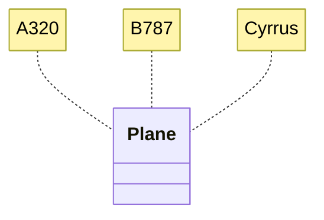
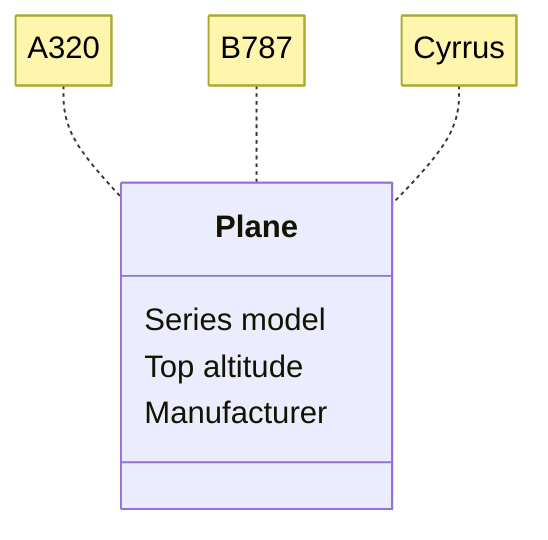
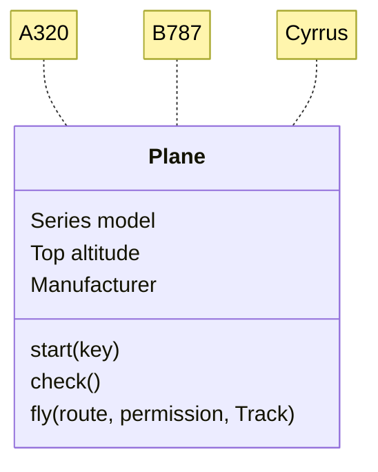
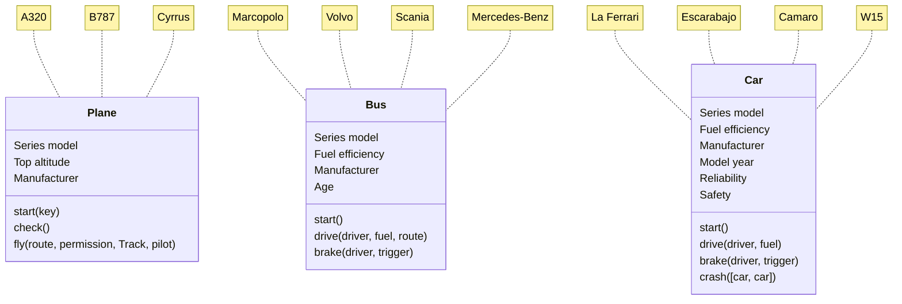
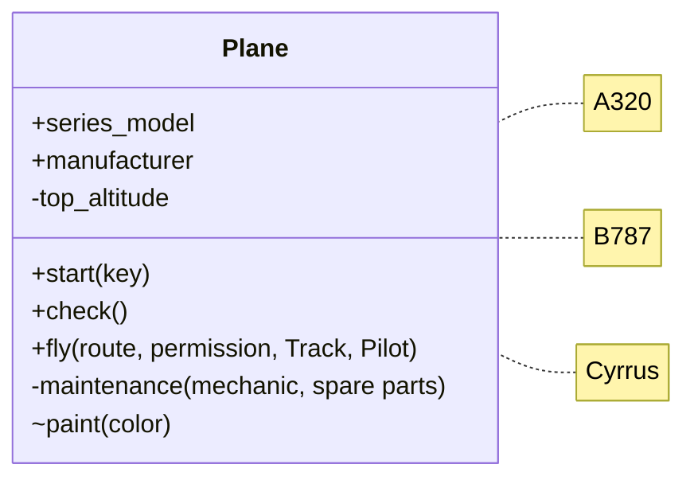
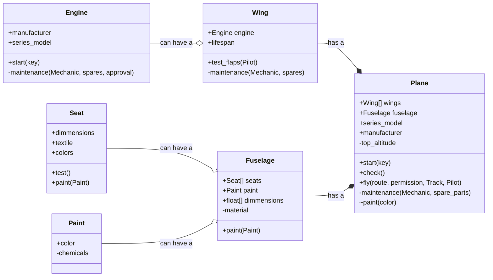
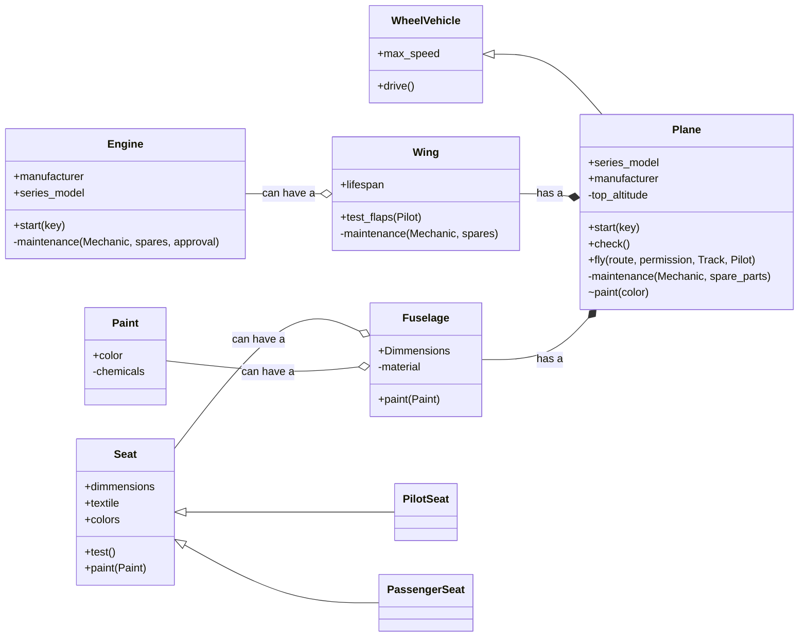

# Object-Oriented Programming

Using *Python 3 Object-Oriented Programming 2nd edition by Dusty Phillips*

## The Object-oriented Strategy

> What does it really mean to be Object-Oriented?
>
> Is it only a programming attribute?
>
> Can it be independent from code?
>

Being object-oriented means essentially it is *directed toward modeling objects*. 

>*An object is a collection of data and behaviors associated to it*.
    
That means objects can do certain actions (just like in real life!) and store some information.

An object-oriented approach is hence a strategy used to match data and behaviors in single elements (objects). Now, when implementing it into a software development project, it involves three main stages:

>| Stage | Description |
>| -------- | ------ | 
>| Analysis (OOA) | ***What** needs to be done? What are the **requirements** to do so?* Problem, system, task (I) -> Subtasks or processes required (O).|
>| Design (OOD) | ***How** will it be done? How will the requirements be turned into an **implementation specification**?* Requirements (I) -> A set of classes and interfaces (O). |
>| Programming (OOP) | ***Where** will the specification be implemented? What **programming language** should be used?* Set of classes and interfaces (I) -> A program with the implementation (O). |

Of course, this is a formal, organized and summarized way of viewing the approach, but in reality it doesn't follow this order (often it will be required to then go back while skipping something), it is way more flexible. Modern methods like iterative development -almost- finish smaller tasks and iterate through them once they work in another task.

## Objects and clases

How do you distinguish between objects in real life? How do you know an orange is an orange and not a building or a plane? Plato said, for instance, that every object was built in accordance to the idea it represents, so an orange is not an apple because we have in our minds an idea (or notion) of what the orange's idea looks like.

In an OOP model, the same perception is used: objects can be grouped around a general concept of them, or rather, they can be produced from a general concept. This general concept holds all the objects' properties or attributes in common and it is what we'll call a *class*.

>*A class is a type or a kind of object that describes its essential attributes and behaviors.*

Therefore, it can be used as a template or a blueprint to create objects of that kind so they can execute some actions (behaviors) and store information in its properties, so:

>*An object is an instance (ocurrence) of a class*

### Attributes

Classes have or hold attributes that correspond to *the properties of the object*. In an object, they often have a value which can (but not necessarily) be different from another object's value. It is where the object's data is stored and, in a way, classified (doesn't matter the value, its true meaning relies on the property it was assigned to).

### Methods

Objects have behaviors, as mentioned earlier, but if they belong to a class then the class must have a way to generalize this behavior, and does so with methods. *Methods are actions that can be executed by a class of objects*. They are essentially functions inside a class, and therefore can also receive parameters, which are refered to as **arguments** inside a method. Arguments are data needed to execute the action (e.g. you cannot ``fly()`` without an ``airplane`` in the real world).

## The process of modeling objects and classes

Although this sounds oddly simmilar to the [object-oriented strategy](#the-object-oriented-strategy) section, but this one refers to the abstraction, definition, hiding and linking of objects and classes.

### Abstraction

We, as humans, extract information from the real world all the time. In fact, some argue we do not even know the world as it truly is, just what we are allowed, by our physical and mental abilities, to comprehend annd grasp. Kant used to say sciences are human sciences, meaning they only work in the 'human' world.

In the same way, we model objects and classes as a world apart, but as close as we can to 'real' life, describing objects' properties and behaviors, while grouping them in classes. This is what abstraction is all about: translating ideas, real-life situations, processes into an object-oriented design, much like taking objects from a dimension to another one without losing any of its essence.

> *Abstraction is the process of grasping enough detail from a task so to model it in object-oriented terms.*

The deal here is you can (and sometimes will need to) skip details of an object in a certain world to bring it to the OOW (Object-Oriented World). To do so, you get with yourself a capsule to the objects' dimension and capture the object so it gives you all the information you need to so you can leave the object free. The capsule now can be opened in the OOW and free the objects' model in a familiar language; that's **encapsulation**.

> *Encapsulation is the process of grouping the extracted data into data capsules or classes (?)*.

Using both abstraction and encapsulation you have objects that are capsules with a little screen to interact with them, so, as another object, you can only know so much, depending on the level of abstraction given to the object you're trying to access (*what* is an object depends on its level of abstraction). 

### Public interface and private internals (encapsulation)

This might be a controversial simile, but we need to model objects the engineering way: we want each object to be a scientist, i.e., that it knows its internal functionality in detail, but when interacting with another objects will become engineers: they will only tell each other what's useful and relevant about them, so the others can work with them without having to deal with the difficult and irrelevant-to-their-purpose stuff.

To put it in formal terms, when being scientists the objects can change its internals without affecting their interaction with other objects, but when being engineers they'll use **information hiding**, which speaks by itself, and so only a **public interface** will be published to the outer objects so they can interact with the object enough to do what they need to do.

This is pretty much abstraction: you translate enough of the object into the object-oriented world so you can know *what* you're dealing with, and depending of how much do you want to know about how it works, it will have different levels of abstraction.

> *Objects will be modeled with different abstraction levels to hide information and only make public a limited interface to interact with them.*

### Composition and aggregation

A Formula 1 car can be seen as such or as the union of many individual parts that together make up the actual car. Some of them may exist independently from the car, in fact all of them are produced independently and exist independently, but most of them don't make sense if they're not a part of the car. Those elements are then related to the F1 because they are its components: A Formula 1 *is composed of* an engine, wheels, the monocoque, the front wing, the rear wing, among others, but only the steering wheel and pedals will be desplayed to the driver for instance.

Another example is a chess game: you got a chess set and two players. What the players are composed of doesn't matter. So, a chess set usually involves pieces and a board with 64 positions. However, the pieces are not related to the board as the positions are: the first ones exist independently from the board whereas the latter ones don't. Why? Take a chess board with pieces over it and shake it: the pieces will fall but the positions won't, because a board is made out of them, and without them it simply isn't a chess board, whilst without pieces it is still a chess board.

These two examples introduce us to composition and aggregation, which indicate the classes of what a class is composed of and the relation between them:

> *Composition is a relation of posession or belonging (a class **has a** class), and of dependent existance (objects).*

> *Aggregation is a relation of incorporation or addition (a class **adds a** class).*

Notice that posession is a form of incorporation, which entails that composition is a form of aggregation. In other words, aggregation and composition are often seen as the same since they are *class* relations, so it is only when an instance of a class is built that the difference will be seen.

### Inheritance

In a family tree, a grandfather, father and son share the same lastname, "Pérez" for example, and so the grandfather might tell to the father "you *are a* Pérez, you *are* hard-working, and you *are* lovely". Then the father tells the same to his son. What's important is that all three *are* a Pérez, and hard-working and lovely, that is, they share the same attributes. However, they do not share the same class since they are in different positions in the family tree, so how come they still share those attributes?

Well, ladies and gentlemen, this is the power of inheritance. It allows us to group different classes of objects into a common class and therefore to inherit the same attributes and methods for different classes. Or, the other way around: a class *is a* more general class, or, an object can belong to a certain class but also to another one since it has some attributes and methods that inherits from a greater class.

> *Inheritance **is a** relation between classes in which one inherits attributes and behaviors from another class.*

It should be mentioned that a parent class is known as a generalization of the child(ren) class(es), and the child(ren) class(es) is(are) a specialization of the parent class.

### Polymorphism
Say you have a bunch of cars, you are indeed the owner of a huge car collection, congratulations! You now want to gather them in categories or classes. You might start by sorting them by their method of propulsion, i.e., electric, hybrid or gas-powered. You then focus on the gas-powered cars and categorize them according to their transmission: mannual, automatic or semi-automatic.

You're now explaining to a friend interesting in buying a car the difference and simmilarities between them, and you stutter when explaining them the different ways you can start different cars: they all start, yes, but each class has a different requirement and a different method to do so. Here is where polymorphism introduces itself.

> *Polymorphism states that certain behaviors can have multiple forms, i.e., it can be different depending on **which class does** it and **what is required** by the executor instance.*

So, with this in mind, you tell your friend all cars get started, but electric and hybrid require to be charged only, and no ignition is needed to start them, whereas the gas-powered machines need fuel and a whole different method to start the engine. Plus, hybrids and automatics often require a button to start the car, while manuals need a neutral gear or the clutch engaged to start the engine. And here is where you notice something different also: there are two types of polymorphism.

> *Overriding is at the least an **addition of some specifications** to a behavior and at most a complete overwriting of the behavior. In any case, it involves **inheritance** by default (the behavior is inherited and then overriden in a subclass).*

> *Overloading is **conditioning** the same behavior to **different contexts** deppending on different requirements or triggers. It doesn't involve inheritance (the behavior is done by the same class).*

Something to note is that overriding occurs during runtime, whereas overloading happens during compile time. The reason lies in inheritance: the overloaded method or behavior will have multiple forms within the class, it is defined that way, whereas an overriden method will only appear once the instance of a subclass is created and the method is called using that instance, because then and only then the method will be necessarily redefined. For more information, click [here](https://www.javatpoint.com/compile-time-vs-runtime).

### Encapsulation

- All classes are **public** by default in Python, in fact, even the private and protected are not really public, since it doesn't realy change anything of the class.
- To set an attribute protected you use a single underscore (_) before its name, and if it is a method you simply add one more at the end (e.g. \_function()\_)
- To set something private use double underscore (__).

Protected only allows the subclasses'instances to modify and access the class' instance's attributes and methods, whereas private doesn't allow any class apart from the on the private and public methods and attributes are declared.

Private methods and attributes of a class can only be changed by an instance of the same class

Usually, private attributes have a protected or public method associated which modify them or show them to the public interface, so it is a way of "violating" the privacy of the attribute using methods of the same class.