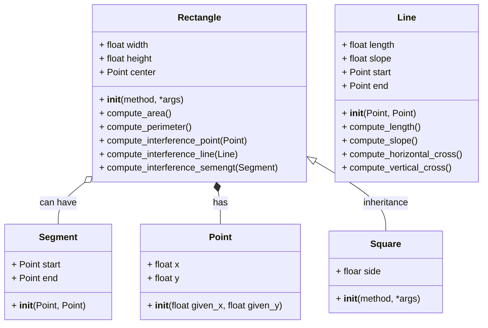

# Rectangle

```mermaid

classDiagram
direction TB
    class Rectangle {
        + float width
        + float height
        + Point center
        + __init__(method, *args)
        + compute_area()
        + compute_perimeter()
        + compute_interference_point(Point)
        + compute_interference_line(Line)
        + compute_interference_semengt(Segment)
    }
    Rectangle o-- Segment: can have
    Rectangle *-- Point: has
    Rectangle <|-- Square: inheritance
    class Point {
        + float x
        + float y
        + __init__(float given_x, float given_y)
    }
    class Square {
        + floar side
        + __init__(method, *args)
    }
    class Line {
        + float length
        + float slope
        + Point start
        + Point end
        + __init__(Point, Point)
        + compute_length()
        + compute_slope()
        + compute_horizontal_cross()
        + compute_vertical_cross()
    }
    class Segment {
        + Point start
        + Point end
        + __init__(Point, Point)
    }
    
```