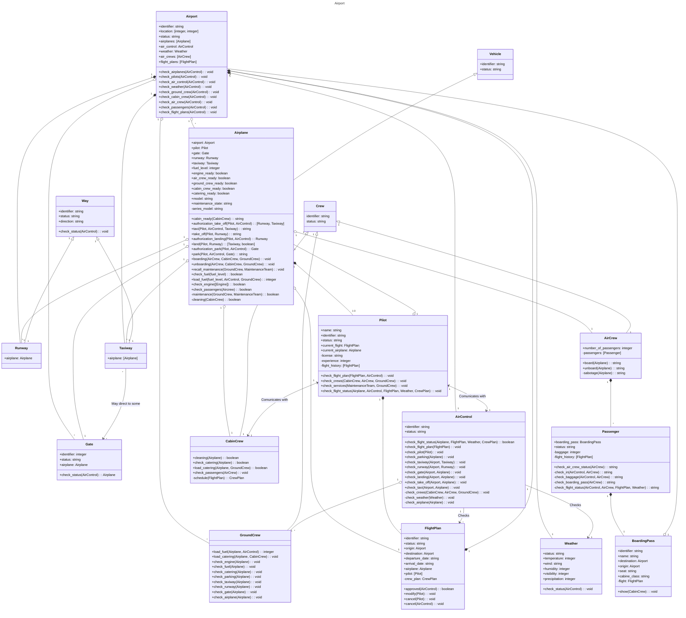

# Airport class diagram

```mermaid
---
title: Airport
---
classDiagram
direction TB

    class Airport {
        +identifier: string
        +location: [integer, integer]
        +status: string
        +airplanes: [Airplane]
        +air_control: AirControl
        +weather: Weather
        +air_crews: [AirCrew]
        +flight_plans: [FlightPlan]

        +check_airplanes(AirControl): void
        +check_pilots(AirControl): void
        +check_air_control(AirControl): void
        +check_weather(AirControl): void
        +check_ground_crew(AirControl): void
        +check_cabin_crew(AirControl): void
        +check_air_crew(AirControl): void
        +check_passengers(AirControl): void
        +check_flight_plans(AirControl): void
    }
    Airport "1" o-- "*" Airplane
    Airport "1" *-- "*" Runway
    Airport "1" *-- "*" Taxiway
    Airport "1" o-- "*" Gate
    Airport "1" *-- "1" AirControl
    Airport "1" *-- "1" Weather
    Airport "1" o-- "*" GroundCrew

    class Vehicle {
        +identifier: string
        +status: string
    }
    Vehicle <|-- Airplane

    class Airplane {
        +airport: Airport
        +pilot: Pilot
        +gate: Gate
        +runway: Runway
        +taxiway: Taxiway
        +fuel_level: integer
        +engine_ready: boolean
        +air_crew_ready: boolean
        +ground_crew_ready: boolean
        +cabin_crew_ready: boolean
        +catering_ready: boolean
        +model: string
        +maintenance_state: string
        -series_model: string

        %% ? When making methods that involve an update of the state, should it return a boolean or with a void is enough?
        
        +cabin_ready(CabinCrew): string
        +authorization_take_off(Pilot, AirControl): [Runway, Taxiway]
        +taxi(Pilot, AirControl, Taxiway): string
        +take_off(Pilot, Runway): string
        +authorization_landing(Pilot, AirControl): Runway
        +land(Pilot, Runway): [Taxiway, boolean]
        +authorization_park(Pilot, AirControl): Gate
        +park(Pilot, AirControl, Gate): string
        +boarding(AirCrew, CabinCrew, GroundCrew): void
        +unboarding(AirCrew, CabinCrew, GroundCrew): void
        +recall_maintenance(GroundCrew, MaintenanceTeam): void
        +check_fuel(fuel_level): boolean
        +load_fuel(fuel_level, AirControl, GroundCrew): integer
        +check_engine([Engine]): boolean
        +check_passengers(Aircrew): boolean
        -maintenance(GroundCrew, MaintenanceTeam): boolean
        -cleaning(CabinCrew): boolean
    }
    Airplane "1" *-- "1-3" Pilot
    Airplane "1" o-- "1" CabinCrew
    Airplane "1" o-- "1" AirCrew
    Airplane "1" o-- "1" FlightPlan
    Airplane "1" o-- "1" Gate
    Airplane "1" o-- "1" Runway
    Airplane "1" o-- "1" Taxiway
    
    class Crew {
        identifier: string
        status: string
    }
    Crew "1" <|-- "1" CabinCrew
    Crew "1" <|-- "1" GroundCrew
    Crew "1" <|-- "1" AirCrew

    class CabinCrew {
        +cleaning(Airplane): boolean
        +check_catering(Airplane): boolean
        +load_catering(Airplane, GroundCrew): boolean
        +check_passengers(AirCrew): void
        -schedule(FlightPlan): CrewPlan
    }

    class GroundCrew {
        +load_fuel(Airplane, AirControl): integer
        +load_catering(Airplane, CabinCrew): void
        +check_engine(Airplane): void
        +check_fuel(Airplane): void
        +check_catering(Airplane): void
        +check_parking(Airplane): void
        +check_taxiway(Airplane): void
        +check_runway(Airplane): void
        +check_gate(Airplane): void
        +check_airplane(Airplane): void
    }

    class AirCrew {
        +number_of_passengers: integer
        -passengers: [Passenger]

        +board(Airplane): string
        +unboard(Airplane): string
        -sabotage(Airplane): string
    }
    AirCrew "1" *-- "*" Passenger

    class Pilot {
        +name: string
        +identifier: string
        +status: string
        +current_flight: FlightPlan
        +current_airplane: Airplane
        -license: string
        -experience: integer
        -flight_history: [FlightPlan]

        +check_flight_plan(FlightPlan, AirControl): void
        +check_crews(CabinCrew, AirCrew, GroundCrew): void
        +check_services(MaintenanceTeam, GroundCrew): void
        +check_flight_status(Airplane, AirControl, FlightPlan, Weather, CrewPlan): void
    }
    Pilot "1" <--> "1" AirControl: Comunicates with
    Pilot "1" *-- "*" FlightPlan
    Pilot "1" o-- "1" Airplane
    Pilot "1" <--> "1" CabinCrew: Comunicates with

    class Passenger {
        +boarding_pass: BoardingPass
        +status: string
        -baggage: integer
        -flight_history: [FlightPlan]

        +check_air_crew_status(AirCrew): string
        -check_in(AirControl, AirCrew): string
        -check_baggage(AirControl, AirCrew): string
        -check_boarding_pass(AirCrew): string
        -check_flight_status(AirControl, AirCrew, FlightPlan, Weather): string
    }
    Passenger "1" *-- "1" BoardingPass

    class BoardingPass {
        +identifier: string
        +name: string
        +destination: Airport
        +origin: Airport
        +seat: string
        +cabine_class: string
        -flight: FlightPlan

        +show(CabinCrew): void
    }

    BoardingPass "1" o-- "2" Airport

    class AirControl {
        +identifier: string
        +status: string

        +check_flight_status(Airplane, FlightPlan, Weather, CrewPlan): boolean
        +check_flight_plan(FlightPlan): void
        +check_pilot(Pilot): void
        +check_parking(Airplane): void
        +check_taxiway(Airport, Taxiway): void
        +check_runway(Airport, Runway): void
        +check_gate(Airport, Airplane): void
        +check_landing(Airport, Airplane): void
        +check_take_off(Airport, Airplane): void
        +check_taxi(Airport, Airplane): void
        -check_crews(CabinCrew, AirCrew, GroundCrew): void
        -check_weather(Weather): void
        -check_airplane(Airplane): void
    }
    AirControl "1" o-- "*" GroundCrew
    AirControl "1" --> "*" FlightPlan: Checks
    AirControl "1" --> "1" Weather: Checks

    class FlightPlan {
        +identifier: string
        +status: string
        +origin: Airport
        +destination: Airport
        +departure_date: string
        +arrival_date: string
        +airplane: Airplane
        +pilot: [Pilot]
        -crew_plan: CrewPlan

        +approved(AirControl): boolean
        +modify(Pilot): void
        +cancel(Pilot): void
        +cancel(AirControl): void
    }

    FlightPlan "1" *-- "2" Airport

    class Way {
        +identifier: string
        +status: string
        +direction: string
        +check_status(AirControl): void
    }
    Way "1" <|-- "1" Runway
    Way "1" <|-- "1" Taxiway

    class Runway {
        +airplane: Airplane
    }

    class Taxiway {
        +airplane: [Airplane]
    }

    Taxiway "*" --> "*" Gate: May direct to some 

    class Gate {
        +identifier: integer
        +status: string
        +airplane: Airplane
        +check_status(AirControl): Airplane
    }

    class Weather {
        +status: string
        +temperature: integer
        +wind: string
        +humidity: integer
        +visibility: integer
        +precipitation: integer
        +check_status(AirControl): void
    }

```