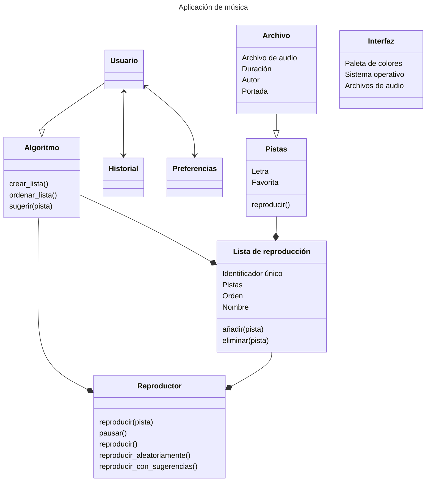

# Aplicación de música

```mermaid
---
title: Aplicación de música
---
classDiagram
    class Usuario {

    }
    Usuario <--> Preferencias
    Usuario <--> Historial
    Usuario --|> Algoritmo

    class Archivo {
        Archivo de audio
        Duración
        Autor
        Portada
    }
    Archivo --|> Pistas
    class Pistas {
        Letra
        Favorita
        reproducir()
    }
    Pistas --* `Lista de reproducción`
    class Interfaz {
        Paleta de colores
        Sistema operativo
        Archivos de audio
    }
    class Algoritmo {
        crear_lista()
        ordenar_lista()
        sugerir(pista)
    }
    Algoritmo --* `Lista de reproducción`
    Algoritmo --* Reproductor

    class `Lista de reproducción` {
        Identificador único
        Pistas
        Orden
        Nombre
        añadir(pista)
        eliminar(pista)
    }
    `Lista de reproducción` --* Reproductor
    class Reproductor {
        reproducir(pista)
        pausar()
        reproducir()
        reproducir_aleatoriamente()
        reproducir_con_sugerencias()

    }
```